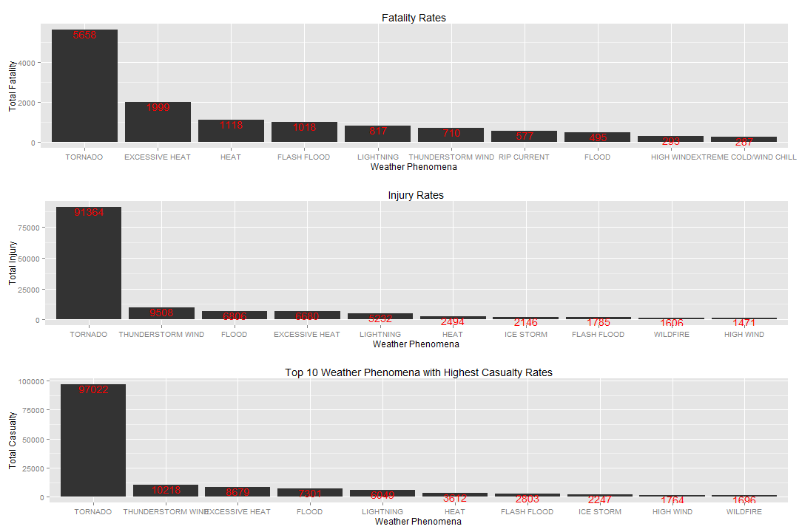
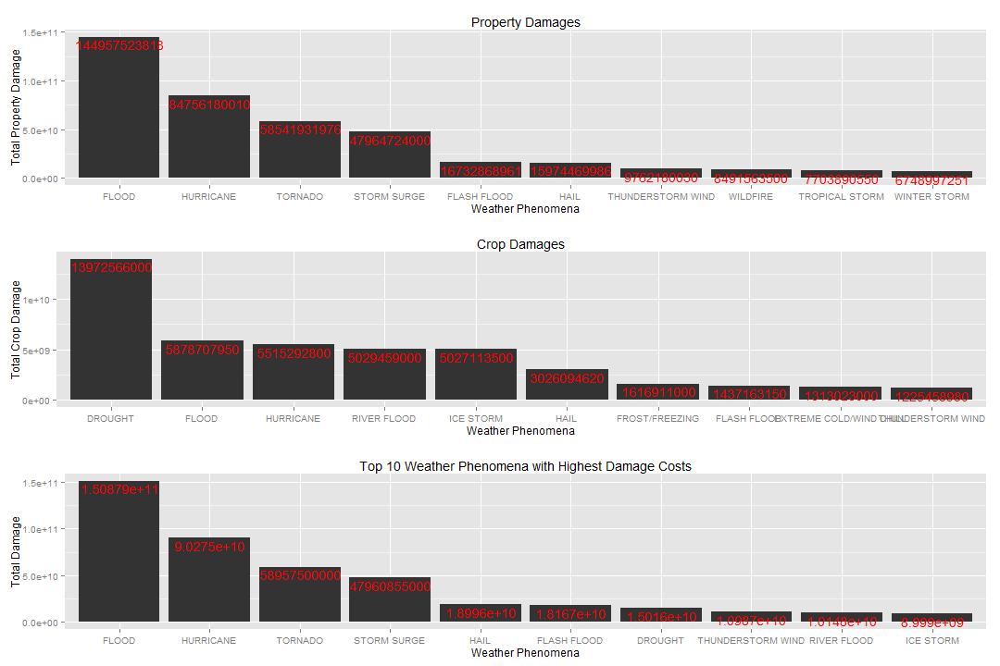
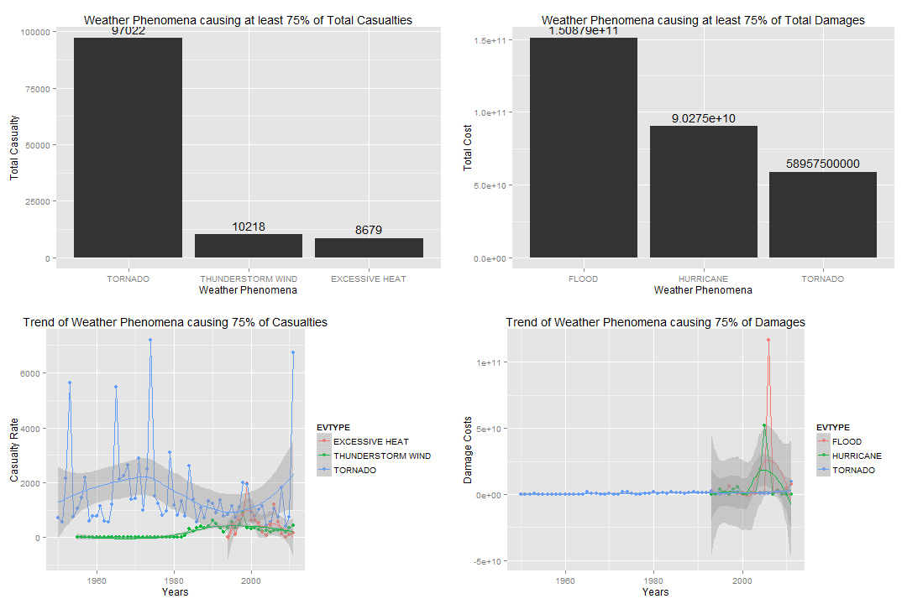

# Impact of Weather Events against Population Health and the Economy of the United States

---


## Synopsis
The following anaylsis looks into the effects of natural weather phenomena in the United States. Data from the National Oceanic and Atmospheric Administration (NOAA) is used to determine the various consequences of weather events such as majors storms that were experienced across the US. Data measured from the occurrance of such events were then used to measure the impact they had on the health of the United States population as well as their effects on the economy across the country.

## Data Processing
The following steps depict the process in which the raw Storm data is read and prepared for analysis.

1. The Storm data is uncompressed and then read as shown.
   "StormData.csv.bz2" is the original compressed file with the NOAA data.

```r
    originalData <- read.csv(bzfile("StormData.csv.bz2"))
```

2. The following is a tabluar representation of the raw data

```
##   STATE__           BGN_DATE BGN_TIME TIME_ZONE COUNTY COUNTYNAME STATE
## 1       1  4/18/1950 0:00:00     0130       CST     97     MOBILE    AL
## 2       1  4/18/1950 0:00:00     0145       CST      3    BALDWIN    AL
## 3       1  2/20/1951 0:00:00     1600       CST     57    FAYETTE    AL
## 4       1   6/8/1951 0:00:00     0900       CST     89    MADISON    AL
## 5       1 11/15/1951 0:00:00     1500       CST     43    CULLMAN    AL
## 6       1 11/15/1951 0:00:00     2000       CST     77 LAUDERDALE    AL
##    EVTYPE BGN_RANGE BGN_AZI BGN_LOCATI END_DATE END_TIME COUNTY_END
## 1 TORNADO         0                                               0
## 2 TORNADO         0                                               0
## 3 TORNADO         0                                               0
## 4 TORNADO         0                                               0
## 5 TORNADO         0                                               0
## 6 TORNADO         0                                               0
##   COUNTYENDN END_RANGE END_AZI END_LOCATI LENGTH WIDTH F MAG FATALITIES
## 1         NA         0                      14.0   100 3   0          0
## 2         NA         0                       2.0   150 2   0          0
## 3         NA         0                       0.1   123 2   0          0
## 4         NA         0                       0.0   100 2   0          0
## 5         NA         0                       0.0   150 2   0          0
## 6         NA         0                       1.5   177 2   0          0
##   INJURIES PROPDMG PROPDMGEXP CROPDMG CROPDMGEXP WFO STATEOFFIC ZONENAMES
## 1       15    25.0          K       0                                    
## 2        0     2.5          K       0                                    
## 3        2    25.0          K       0                                    
## 4        2     2.5          K       0                                    
## 5        2     2.5          K       0                                    
## 6        6     2.5          K       0                                    
##   LATITUDE LONGITUDE LATITUDE_E LONGITUDE_ REMARKS REFNUM
## 1     3040      8812       3051       8806              1
## 2     3042      8755          0          0              2
## 3     3340      8742          0          0              3
## 4     3458      8626          0          0              4
## 5     3412      8642          0          0              5
## 6     3450      8748          0          0              6
```

3. The follow shows all the types of weather phenomena in the data.

```r
    originalData$INDEX <- 1
    eventTypes <- aggregate(data=originalData, INDEX~EVTYPE, FUN=sum)
    eventTypes <- eventTypes[order(eventTypes$EVTYPE),]
```

```
##  [1]    HIGH SURF ADVISORY   COASTAL FLOOD          FLASH FLOOD          
##  [4]  LIGHTNING              TSTM WIND              TSTM WIND (G45)      
##  [7]  WATERSPOUT             WIND                  ?                     
## [10] ABNORMAL WARMTH        ABNORMALLY DRY         ABNORMALLY WET        
## [13] ACCUMULATED SNOWFALL   AGRICULTURAL FREEZE    APACHE COUNTY         
## [16] ASTRONOMICAL HIGH TIDE ASTRONOMICAL LOW TIDE  AVALANCE              
## [19] AVALANCHE              BEACH EROSIN          
## 985 Levels:    HIGH SURF ADVISORY  COASTAL FLOOD ... WND
```

It can been seen that the listed types of phenomena contain many duplicates of varying issues, for example, spelling errors, mixture of random uppercase and lowercase alphabets and events of the same type but sub-categorized.

The following procedures are then performed in an attempt to solve or reduce the above issues.


```r
workData <- originalData

workData$EVTYPE <- lapply(workData$EVTYPE, function(v) {
  return(toupper(v))
})
workData$EVTYPE <- as.factor(unlist(workData$EVTYPE))

workData$EVTYPE <- gsub("^\\s+|\\s+$", "", workData$EVTYPE)
workData$EVTYPE <- gsub("^AVALANCE", "AVALANCHE", workData$EVTYPE)
workData$EVTYPE <- gsub("^BITTER WIND CHILL TEMPERATURES", "BITTER WIND CHILL", workData$EVTYPE)
workData$EVTYPE <- gsub("^BEACH EROSIN", "BEACH EROSION", workData$EVTYPE)
workData$EVTYPE <- gsub("^(BEACH EROSION).*", "BEACH EROSION", workData$EVTYPE)
workData$EVTYPE <- gsub("^(BITTER WIND CHILL).*", "BITTER WIND CHILL", workData$EVTYPE)
workData$EVTYPE <- gsub("^(BLIZZARD).*", "BLIZZARD", workData$EVTYPE)
workData$EVTYPE <- gsub("^(BLOWING SNOW).*", "BLIZZARD", workData$EVTYPE)
workData$EVTYPE <- gsub("^(COASTAL FLOOD).*", "COASTAL FLOOD", workData$EVTYPE)
workData$EVTYPE <- gsub("^(COLD).*", "COLD/WIND CHILL", workData$EVTYPE)
workData$EVTYPE <- gsub("^(DRY).*", "DRY", workData$EVTYPE)
workData$EVTYPE <- gsub("^(EXTREME WIND).*", "EXTREME WIND", workData$EVTYPE)
workData$EVTYPE <- gsub("^(EXTREME COLD).*", "EXTREME COLD/WIND CHILL", workData$EVTYPE)
workData$EVTYPE <- gsub("^(DRY).*", "DRY MICROBURST", workData$EVTYPE)
workData$EVTYPE <- gsub("^(MICROBURST).*", "DRY MICROBURST", workData$EVTYPE)
workData$EVTYPE <- gsub("^(DUST DEVIL).*", "DUST DEVIL", workData$EVTYPE)
workData$EVTYPE <- gsub("^(DUST STORM).*", "DUST STORM", workData$EVTYPE)
workData$EVTYPE <- gsub("^(EXCESSIVE HEAT).*", "EXCESSIVE HEAT", workData$EVTYPE)
workData$EVTYPE <- gsub("^(EXCESSIVE SNOW).*", "BLIZZARD", workData$EVTYPE)
workData$EVTYPE <- gsub("^(EXTREME HEAT).*", "EXCESSIVE HEAT", workData$EVTYPE)
workData$EVTYPE <- gsub("^(FLASH FLOO).*", "FLASH FLOOD", workData$EVTYPE)
workData$EVTYPE <- gsub("^(FLOOD).*", "FLOOD", workData$EVTYPE)
workData$EVTYPE <- gsub("^(FOG).*", "1FREEzING FOG", workData$EVTYPE)
workData$EVTYPE <- gsub("^(FREEzING FOG).*", "1FREEzING FOG", workData$EVTYPE)
workData$EVTYPE <- gsub("^(FROST).*", "FROST/FREEZING", workData$EVTYPE)
workData$EVTYPE <- gsub("^(FREEZ).*", "FROST/FREEZING", workData$EVTYPE)
workData$EVTYPE <- gsub("^(1FREEzING FOG).*", "FREEzING FOG", workData$EVTYPE)
workData$EVTYPE <- gsub("^(FUNNEL).*", "FUNNEL CLOUD", workData$EVTYPE)
workData$EVTYPE <- gsub("^(GLAZE).*", "GLAZE", workData$EVTYPE)
workData$EVTYPE <- gsub("^(GUSTY).*", "GUSTY WIND", workData$EVTYPE)
workData$EVTYPE <- gsub("^(HAIL).*", "HAIL", workData$EVTYPE)
workData$EVTYPE <- gsub("^(HEAT).*", "HEAT", workData$EVTYPE)
workData$EVTYPE <- gsub("^(HEAVY RAIN).*", "HEAVY RAIN", workData$EVTYPE)
workData$EVTYPE <- gsub("^(HEAVY PRECIPITATION).*", "HEAVY RAIN", workData$EVTYPE)
workData$EVTYPE <- gsub("^(HEAVY SNOW).*", "HEAVY SNOW", workData$EVTYPE)
workData$EVTYPE <- gsub("^(HEAVY SURF).*", "HIGH SURF", workData$EVTYPE)
workData$EVTYPE <- gsub("^(HIGH SURF).*", "HIGH SURF", workData$EVTYPE)
workData$EVTYPE <- gsub("^(HIGH WIND).*", "HIGH WIND", workData$EVTYPE)
workData$EVTYPE <- gsub("^(HURRICANE).*", "HURRICANE", workData$EVTYPE)
workData$EVTYPE <- gsub("^(ICE|ICY).*", "ICE STORM", workData$EVTYPE)
workData$EVTYPE <- gsub("^(LAKE EFFECT).*", "LAKE-EFFECT SNOW", workData$EVTYPE)
workData$EVTYPE <- gsub("^(LIGHT SNOW).*", "LIGHT SNOW", workData$EVTYPE)
workData$EVTYPE <- gsub("^(LIGHTNING).*", "LIGHTNING", workData$EVTYPE)
workData$EVTYPE <- gsub("^(LIGHTING).*", "LIGHTNING", workData$EVTYPE)
workData$EVTYPE <- gsub("^(MICROBURST).*", "DRY MICROBURST", workData$EVTYPE)
workData$EVTYPE <- gsub("(TSTM)", "THUNDERSTORM", workData$EVTYPE)
workData$EVTYPE <- gsub("^(MUD).*", "MUD SLIDE", workData$EVTYPE)
workData$EVTYPE <- gsub("^(RIP CURRENT).*", "RIP CURRENT", workData$EVTYPE)
workData$EVTYPE <- gsub("^(SNOW).*", "SNOW", workData$EVTYPE)
workData$EVTYPE <- gsub("^(STRONG WIND).*", "STRONG WIND", workData$EVTYPE)
workData$EVTYPE <- gsub("^(STORM SURGE).*", "STORM SURGE", workData$EVTYPE)
workData$EVTYPE <- gsub("^(THUNDERSTORM).*", "THUNDERSTORM WIND", workData$EVTYPE)
workData$EVTYPE <- gsub("^(TORNADO).*", "TORNADO", workData$EVTYPE)
workData$EVTYPE <- gsub("^(TSTM).*", "THUNDERSTORM WIND", workData$EVTYPE)
workData$EVTYPE <- gsub("^(WATERSPOUT).*", "WATERSPOUT", workData$EVTYPE)
workData$EVTYPE <- gsub("^(WILD).*", "WILDFIRE", workData$EVTYPE)
workData$EVTYPE <- gsub("^(WIND).*", "WIND", workData$EVTYPE)
workData$EVTYPE <- gsub("^(WINTER STORM).*", "WINTER STORM", workData$EVTYPE)
workData$EVTYPE <- gsub("^(WINTER WEATHER).*", "WINTER WEATHER", workData$EVTYPE)
```
  
After filtering and modified the event type names as necessary, the event type list have been changed to the following which will then be used for the analysis.

```r
    eventTypes <- aggregate(data=workData, INDEX~EVTYPE, FUN=sum)
    eventTypes <- eventTypes[order(eventTypes$EVTYPE),]
```

```
##  [1] "?"                          "ABNORMAL WARMTH"           
##  [3] "ABNORMALLY DRY"             "ABNORMALLY WET"            
##  [5] "ACCUMULATED SNOWFALL"       "AGRICULTURAL FREEZE"       
##  [7] "APACHE COUNTY"              "ASTRONOMICAL HIGH TIDE"    
##  [9] "ASTRONOMICAL LOW TIDE"      "AVALANCHE"                 
## [11] "BEACH EROSION"              "BEACH FLOOD"               
## [13] "BELOW NORMAL PRECIPITATION" "BITTER WIND CHILL"         
## [15] "BLACK ICE"                  "BLIZZARD"                  
## [17] "BLOW-OUT TIDE"              "BLOW-OUT TIDES"            
## [19] "BLOWING DUST"               "BREAKUP FLOODING"
```

>Across the United States, which types of events (as indicated in the EVTYPE variable) are most harmful with respect to population health?

The above question asks for the impact that the various weather phenomena have on the health of the United States population.

In light of the above question, this analysis will provide a view on which of the weather phenomena caused the most harm to people.

The raw data is processed to gather data on the Casualty rate of the various weather phenomena. The process data is then ranked in the order of fatalities then injuries.

  1. Pre-analysis preparation
    
    ```r
    # This is a function to add both fatality and injury numbers
    CasualtyCalculation <- function(fatality, injury) {
      return (as.numeric(fatality) + as.numeric(injury))
    }
    ```
    
  2. Fatality data is processed as shown:
    
    ```r
    eventFatalities <- aggregate(data=workData, FATALITIES~EVTYPE, FUN=sum)
    
    rankedEventFatalities <- eventFatalities[order(-eventFatalities$FATALITIES),]
    ```

    
     The top 10 phenomena causing the highest fatality rates are as follows:
    
    ```
    ##                     EVTYPE FATALITIES
    ## 1                  TORNADO       5658
    ## 2           EXCESSIVE HEAT       1999
    ## 3                     HEAT       1118
    ## 4              FLASH FLOOD       1018
    ## 5                LIGHTNING        817
    ## 6        THUNDERSTORM WIND        710
    ## 7              RIP CURRENT        577
    ## 8                    FLOOD        495
    ## 9                HIGH WIND        293
    ## 10 EXTREME COLD/WIND CHILL        287
    ```
      
  3. Injury data is processed as shown:
    
    ```r
    eventInjuries <- aggregate(data=workData, INJURIES~EVTYPE, FUN=sum)
    
    rankedEventInjuries <- eventInjuries[order(-eventInjuries$INJURIES),]
    ```

    
     The top 10 phenomena causing the highest injury rates are as follows:
    
    ```
    ##               EVTYPE INJURIES
    ## 1            TORNADO    91364
    ## 2  THUNDERSTORM WIND     9508
    ## 3              FLOOD     6806
    ## 4     EXCESSIVE HEAT     6680
    ## 5          LIGHTNING     5232
    ## 6               HEAT     2494
    ## 7          ICE STORM     2146
    ## 8        FLASH FLOOD     1785
    ## 9           WILDFIRE     1606
    ## 10         HIGH WIND     1471
    ```
    
  4. The fatality and injury numbers are then combined as shown:
    
    ```r
    eventCasualties <- merge(eventFatalities, eventInjuries, by=c("EVTYPE"))
    
    valueCasualtyFull <- apply(
      X=eventCasualties,
      MARGIN=1,
      FUN=function(data) CasualtyCalculation(data["FATALITIES"],data["INJURIES"])
    )
    
    valueCasualtyFullNum <- as.numeric(as.character(valueCasualtyFull))
    
    eventCasualties$TOTAL <- valueCasualtyFullNum
    
    rankedEventCasualties <- eventCasualties[order(-eventCasualties$TOTAL),]
    ```

    
     The following are the top 10 weather phenomena causing the highest total Casualty rates.
    
    ```
    ##               EVTYPE FATALITIES INJURIES TOTAL
    ## 1            TORNADO       5658    91364 97022
    ## 2  THUNDERSTORM WIND        710     9508 10218
    ## 3     EXCESSIVE HEAT       1999     6680  8679
    ## 4              FLOOD        495     6806  7301
    ## 5          LIGHTNING        817     5232  6049
    ## 6               HEAT       1118     2494  3612
    ## 7        FLASH FLOOD       1018     1785  2803
    ## 8          ICE STORM        101     2146  2247
    ## 9          HIGH WIND        293     1471  1764
    ## 10          WILDFIRE         90     1606  1696
    ```
    
  5. A visual representation of the data as shown previously:
    
    ```r
        eventFatalitiesPlot <- ggplot(
              rankedEventFatalities[1:10,],
              aes(
                x=reorder(EVTYPE, -FATALITIES),
                y=FATALITIES
              )
            ) +
            ggtitle("Fatality Rates") +
            geom_bar(stat = "identity") +
            geom_text(
              aes(
                label=ceiling(FATALITIES),
                hjust=0.5,
                vjust=1
              ),
              color="red"
            ) +
            xlab("Weather Phenomena") +
            ylab("Total Fatality")
    
        eventInjuriesPlot <- ggplot(
              rankedEventInjuries[1:10,],
              aes(
                x=reorder(EVTYPE, -INJURIES),
                y=INJURIES
              )
            ) +
            ggtitle("Injury Rates") +
            geom_bar(stat = "identity") +
            geom_text(
              aes(
                label=ceiling(INJURIES),
                hjust=0.5,
                vjust=1
              ),
              color="red"
            ) +
            xlab("Weather Phenomena") +
            ylab("Total Injury")
    
        eventCasualtiesPlot <- ggplot(
              rankedEventCasualties[1:10,],
              aes(
                x=reorder(EVTYPE, -TOTAL),
                y=TOTAL
              )
            ) +
            ggtitle("Top 10 Weather Phenomena with Highest Casualty Rates") +
            geom_bar(stat = "identity") +
            geom_text(
              aes(
                label=ceiling(TOTAL),
                hjust=0.5,
                vjust=1
              ),
              color="red"
            ) +
            xlab("Weather Phenomena") +
            ylab("Total Casualty")
    
        grid.arrange(eventFatalitiesPlot, eventInjuriesPlot, eventCasualtiesPlot, ncol=1)
    ```
    
     

  6. Preparation of working data for time-series trend of the weather phenomena contributing to at least 75% of casualty rate.
    
    ```r
        workData$BGN_DATE <- mdy_hms(workData$BGN_DATE)
        workData$EVENTYEAR <- year(workData$BGN_DATE)
    
        eventCasualtyFull <- apply(
          X=workData,
          MARGIN=1,
          FUN=function(data) CasualtyCalculation(data["FATALITIES"],data["INJURIES"])
        )
    
        eventCasualtyFullNum <- as.numeric(as.character(eventCasualtyFull))
    
        workData$CASUALTYTOTAL <- eventCasualtyFullNum
    
        eventCasualtyByYear <- aggregate(data=workData, CASUALTYTOTAL~EVTYPE+EVENTYEAR, FUN=sum)
    
        eventCasualtyByYearOrdered <- eventCasualtyByYear[order(-eventCasualtyByYear$CASUALTYTOTAL),]
    ```

>Across the United States, which types of events have the greatest economic consequences?

The above question asks for the impact that the various weather phenomena have on the economy of the United States,

In light of the above question, this analysis will provide a view on which of the weather phenomena caused the most property and crop damaged viewed as cost.

The raw data is processed to gather data on the property damange costs. The process data is then ranked by the cost with the weather phenomena causing the most expensive damage in the first position.

  1. Pre-analysis preparation
    
    ```r
    # This is a function used to calculate the actual cost of the damage
    fullValueCalculation <- function(val, exp) {
      if (exp == "H" || exp == "h") {
        return (as.numeric(val)*100)
      }
      else if (exp == "K" || exp == "k") {
        return (as.numeric(val)*1000)
      }
      else if (exp == "M" || exp == "m") {
        return (as.numeric(val)*1000000)
      }
      else if (exp == "B" || exp == "b") {
        return (as.numeric(val)*1000000000)
      }
      else if (val == 0 || exp == "") {
        return (as.numeric(0))
      }
      else {
        return (as.numeric(val))
      }
    }
    
    # This is a function to add both property and crop cost
    damageCalculation <- function(property, crop) {
      return (as.numeric(property) + as.numeric(crop))
    }
    ```
    
  2. Data for property damages is as shown:
    
    ```r
    propDmgValues <- apply(
      X=workData,
      MARGIN=1,
      FUN=function(data) fullValueCalculation(data["PROPDMG"],data["PROPDMGEXP"])
    )
      
    propDmgValues <- as.numeric(as.character(propDmgValues))
      
    workData$PROPDMGVAL <- propDmgValues
      
    eventPropDmg <- aggregate(data=workData, PROPDMGVAL~EVTYPE, FUN=sum)
    
    rankedEventPropDmg <- eventPropDmg[order(-eventPropDmg$PROPDMGVAL),]
    ```

      
     The following are the top 10 weather phenomena that costed the highest in property damage.
    
    ```
    ##               EVTYPE PROPDMGVAL
    ## 1              FLOOD  1.450e+11
    ## 2          HURRICANE  8.476e+10
    ## 3            TORNADO  5.854e+10
    ## 4        STORM SURGE  4.796e+10
    ## 5        FLASH FLOOD  1.673e+10
    ## 6               HAIL  1.597e+10
    ## 7  THUNDERSTORM WIND  9.762e+09
    ## 8           WILDFIRE  8.492e+09
    ## 9     TROPICAL STORM  7.704e+09
    ## 10      WINTER STORM  6.749e+09
    ```

  3. Data for crop damages is as shown:
    
    ```r
    cropDmgValues <-apply(
      X=workData,
      MARGIN=1,
      FUN=function(data) fullValueCalculation(data["CROPDMG"],data["CROPDMGEXP"])
    )
      
    cropDmgValues <- as.numeric(as.character(cropDmgValues))
      
    workData$CROPDMGVAL <- cropDmgValues
      
    eventCropDmg <- aggregate(data=workData, CROPDMGVAL~EVTYPE, FUN=sum)
    
    rankedEventCropDmg <- eventCropDmg[order(-eventCropDmg$CROPDMGVAL),]
    ```

    
     The following are the top 10 weather phenomena that costed the highest in crop damage.
    
    ```
    ##                     EVTYPE CROPDMGVAL
    ## 1                  DROUGHT  1.397e+10
    ## 2                    FLOOD  5.879e+09
    ## 3                HURRICANE  5.515e+09
    ## 4              RIVER FLOOD  5.029e+09
    ## 5                ICE STORM  5.027e+09
    ## 6                     HAIL  3.026e+09
    ## 7           FROST/FREEZING  1.617e+09
    ## 8              FLASH FLOOD  1.437e+09
    ## 9  EXTREME COLD/WIND CHILL  1.313e+09
    ## 10       THUNDERSTORM WIND  1.225e+09
    ```

  4. The combined cost for property and crop damages are as follows:
    
    ```r
    eventDmgCosts <- merge(eventPropDmg, eventCropDmg, by=c("EVTYPE"))
    
    valueDmgCosts <- apply(
      X=eventDmgCosts,
      MARGIN=1,
      FUN=function(data) damageCalculation(data["PROPDMGVAL"],data["CROPDMGVAL"])
    )
    
    valueDmgCostsNum <- as.numeric(as.character(valueDmgCosts))
    
    eventDmgCosts$TOTAL <- valueDmgCostsNum
    
    rankedEventDmgCosts <- eventDmgCosts[order(-eventDmgCosts$TOTAL),]
    ```

    
     The following are the top 10 weather phenomena costing the highest in damages.
    
    ```
    ##               EVTYPE PROPDMGVAL CROPDMGVAL     TOTAL
    ## 1              FLOOD  1.450e+11  5.879e+09 1.509e+11
    ## 2          HURRICANE  8.476e+10  5.515e+09 9.028e+10
    ## 3            TORNADO  5.854e+10  4.175e+08 5.896e+10
    ## 4        STORM SURGE  4.796e+10  8.550e+05 4.796e+10
    ## 5               HAIL  1.597e+10  3.026e+09 1.900e+10
    ## 6        FLASH FLOOD  1.673e+10  1.437e+09 1.817e+10
    ## 7            DROUGHT  1.046e+09  1.397e+10 1.502e+10
    ## 8  THUNDERSTORM WIND  9.762e+09  1.225e+09 1.099e+10
    ## 9        RIVER FLOOD  5.119e+09  5.029e+09 1.015e+10
    ## 10         ICE STORM  3.972e+09  5.027e+09 8.999e+09
    ```
    
  5. The following graphs presents the above data.
    
    ```r
      eventPropDmgPlot <- ggplot(
              rankedEventPropDmg[1:10,],
              aes(
                x=reorder(EVTYPE, -PROPDMGVAL),
                y=PROPDMGVAL
              )
            ) +
            ggtitle("Property Damages") +
            geom_bar(stat = "identity") +
            geom_text(
              aes(
                label=ceiling(PROPDMGVAL),
                hjust=0.5,
                vjust=1.25
              ),
              color="red"
            ) +
            xlab("Weather Phenomena") +
            ylab("Total Property Damage")
    
      eventCropDmgPlot <- ggplot(
              rankedEventCropDmg[1:10,],
              aes(
                x=reorder(EVTYPE, -CROPDMGVAL),
                y=CROPDMGVAL
              )
            ) +
            ggtitle("Crop Damages") +
            geom_bar(stat = "identity") +
            geom_text(
              aes(
                label=ceiling(CROPDMGVAL),
                hjust=0.5,
                vjust=1.25
              ),
              color="red"
            ) +
            xlab("Weather Phenomena") +
            ylab("Total Crop Damage")
    
      eventTotalDmgPlot <- ggplot(
              rankedEventDmgCosts[1:10,],
              aes(
                x=reorder(EVTYPE, -TOTAL),
                y=TOTAL
              )
            ) +
            ggtitle("Top 10 Weather Phenomena with Highest Damage Costs") +
            geom_bar(stat = "identity") +
            geom_text(
              aes(
                label=ceiling(TOTAL),
                hjust=0.5,
                vjust=1.25
              ),
              color="red"
            ) +
            xlab("Weather Phenomena") +
            ylab("Total Damage")
    
      grid.arrange(eventPropDmgPlot, eventCropDmgPlot, eventTotalDmgPlot, ncol=1)
    ```
    
     
    
    6. Preparation of working data for time-series trend of the weather phenomena contributing to at least 75% of damage costs.
    
    ```r
        eventDamageCosts <- apply(
          X=workData,
          MARGIN=1,
          FUN=function(data) damageCalculation(data["PROPDMGVAL"],data["CROPDMGVAL"])
        )
    
        eventDamageCostsNum <- as.numeric(as.character(eventDamageCosts))
    
        workData$DAMAGETOTAL <- eventDamageCostsNum
        
        eventDamageByYear <- aggregate(data=workData, DAMAGETOTAL~EVTYPE+EVENTYEAR, FUN=sum)
    
        eventDamageByYearOrdered <- eventDamageByYear[order(-eventDamageByYear$DAMAGETOTAL),]
    ```

## Results
The impact of most severe weather phenomena causing the greatest (top 10) in casualties and damages are summarised here.

  1. Data summary
    
    1. Casualty Rate
    
    ```r
      summary(rankedEventCasualties[1:10,2:4])
    ```
    
    ```
    ##    FATALITIES      INJURIES         TOTAL      
    ##  Min.   :  90   Min.   : 1471   Min.   : 1696  
    ##  1st Qu.: 344   1st Qu.: 1875   1st Qu.: 2386  
    ##  Median : 764   Median : 3863   Median : 4830  
    ##  Mean   :1230   Mean   :12909   Mean   :14139  
    ##  3rd Qu.:1093   3rd Qu.: 6774   3rd Qu.: 8334  
    ##  Max.   :5658   Max.   :91364   Max.   :97022
    ```
       
    
    2. Damage Costs
    
    ```r
      summary(rankedEventDmgCosts[1:10,2:4])
    ```
    
    ```
    ##    PROPDMGVAL         CROPDMGVAL           TOTAL         
    ##  Min.   :1.05e+09   Min.   :8.55e+05   Min.   :9.00e+09  
    ##  1st Qu.:6.28e+09   1st Qu.:1.28e+09   1st Qu.:1.20e+10  
    ##  Median :1.64e+10   Median :4.03e+09   Median :1.86e+10  
    ##  Mean   :3.89e+10   Mean   :4.15e+09   Mean   :4.30e+10  
    ##  3rd Qu.:5.59e+10   3rd Qu.:5.39e+09   3rd Qu.:5.62e+10  
    ##  Max.   :1.45e+11   Max.   :1.40e+10   Max.   :1.51e+11
    ```
    
  2. Weather phenomena within the top 10 most servere, causing at least 75% of the calculated harm (casualties or damages)
  
    A. Impact to human lives: Fatalities
    
    ```r
      rankedEventCasualties[rankedEventCasualties$FATALITIES >= quantile(rankedEventCasualties[1:10,2], c(0.75)),]
    ```
    
    ```
    ##           EVTYPE FATALITIES INJURIES TOTAL
    ## 1        TORNADO       5658    91364 97022
    ## 3 EXCESSIVE HEAT       1999     6680  8679
    ## 6           HEAT       1118     2494  3612
    ```
    
    B. Impact to human lives: Injuries
    
    ```r
      rankedEventCasualties[rankedEventCasualties$INJURIES >= quantile(rankedEventCasualties[1:10,3], c(0.75)),]
    ```
    
    ```
    ##              EVTYPE FATALITIES INJURIES TOTAL
    ## 1           TORNADO       5658    91364 97022
    ## 2 THUNDERSTORM WIND        710     9508 10218
    ## 4             FLOOD        495     6806  7301
    ```
    
    C. Impact to human lives: Total
    
    ```r
      impactCasualtiesTotal <- rankedEventCasualties[rankedEventCasualties$TOTAL >= quantile(rankedEventCasualties[1:10,4], c(0.75)),]
      noOfCasualties3rdQuantile <- nrow(impactCasualtiesTotal)
    ```
    
    ```
    ##              EVTYPE FATALITIES INJURIES TOTAL
    ## 1           TORNADO       5658    91364 97022
    ## 2 THUNDERSTORM WIND        710     9508 10218
    ## 3    EXCESSIVE HEAT       1999     6680  8679
    ```
        
    D. Impact to infrastructure: Properties
    
    ```r
      rankedEventDmgCosts[rankedEventDmgCosts$PROPDMGVAL >= quantile(rankedEventDmgCosts[1:10,2], c(0.75)),]
    ```
    
    ```
    ##      EVTYPE PROPDMGVAL CROPDMGVAL     TOTAL
    ## 1     FLOOD  1.450e+11  5.879e+09 1.509e+11
    ## 2 HURRICANE  8.476e+10  5.515e+09 9.028e+10
    ## 3   TORNADO  5.854e+10  4.175e+08 5.896e+10
    ```
    
    E. Impact to infrastructure: Crops
    
    ```r
      rankedEventDmgCosts[rankedEventDmgCosts$CROPDMGVAL >= quantile(rankedEventDmgCosts[1:10,3], c(0.75)),]
    ```
    
    ```
    ##      EVTYPE PROPDMGVAL CROPDMGVAL     TOTAL
    ## 1     FLOOD  1.450e+11  5.879e+09 1.509e+11
    ## 2 HURRICANE  8.476e+10  5.515e+09 9.028e+10
    ## 7   DROUGHT  1.046e+09  1.397e+10 1.502e+10
    ```
    
    F. Impact to infrastructure: Total
    
    ```r
      impactDamagesTotal <- rankedEventDmgCosts[rankedEventDmgCosts$TOTAL >= quantile(rankedEventDmgCosts[1:10,4], c(0.75)),]
      noOfDamages3rdQuantile <- nrow(impactDamagesTotal)
    ```
    
    ```
    ##      EVTYPE PROPDMGVAL CROPDMGVAL     TOTAL
    ## 1     FLOOD  1.450e+11  5.879e+09 1.509e+11
    ## 2 HURRICANE  8.476e+10  5.515e+09 9.028e+10
    ## 3   TORNADO  5.854e+10  4.175e+08 5.896e+10
    ```
  
  5. Visual Representation of weather phenomena causing at least 75% of the total calculated harm (casualties or damages) and the time-series trend for years in record.
    
    ```r
        casualtyPlot <- ggplot(
              rankedEventCasualties[1:3,],
              aes(
                x=reorder(EVTYPE, -TOTAL),
                y=TOTAL,
                factor(TOTAL)
              )
            ) +
            ggtitle("Weather Phenomena causing at least 75% of Total Casualties") +
            geom_bar(stat = "identity") +
            geom_text(
              aes(
                label=ceiling(TOTAL),
                hjust=0.5,
                vjust=-0.5
              )
            ) +
            xlab("Weather Phenomena") +
            ylab("Total Casualty")
    
        damagePlot <- ggplot(
              rankedEventDmgCosts[1:3,],
              aes( 
                x=reorder(EVTYPE, -TOTAL),
                y=TOTAL
              )
            ) +
            ggtitle("Weather Phenomena causing at least 75% of Total Damages") +
            geom_bar(stat = "identity") +
            geom_text(
              aes(
                label=ceiling(TOTAL),
                hjust=0.5,
                vjust=-0.5
              )
            ) +
            xlab("Weather Phenomena") +
            ylab("Total Cost")
            
        casualtyTrend <- ggplot(
              data=eventCasualtyByYearOrdered[eventCasualtyByYearOrdered$EVTYPE %in% impactCasualtiesTotal$EVTYPE,],
              aes(
                x=EVENTYEAR,
                y=CASUALTYTOTAL,
                group=EVTYPE,
                color=EVTYPE
              )
            ) +
            ggtitle("Trend of Weather Phenomena causing 75% of Casualties") +
            geom_line() +
            geom_point() +
            geom_smooth(method="loess") +
            xlab("Years") +
            ylab("Casualty Rate")
    
        damageTrend <- ggplot(
              data=eventDamageByYearOrdered[eventDamageByYearOrdered$EVTYPE %in% impactDamagesTotal$EVTYPE,],
              aes(
                x=EVENTYEAR,
                y=DAMAGETOTAL,
                group=EVTYPE,
                color=EVTYPE
              )
            ) +
            ggtitle("Trend of Weather Phenomena causing 75% of Damages") +
            geom_line() +
            geom_point() +
            geom_smooth(method="loess") +
            xlab("Years") +
            ylab("Damage Costs")
    
        grid.arrange(casualtyPlot, damagePlot, casualtyTrend, damageTrend, ncol=2)
    ```
    
     

## Reproducing this Analysis

The setup used to perform this analysis is as follows:

```r
    sessionInfo()
```

```
## R version 3.1.0 (2014-04-10)
## Platform: x86_64-w64-mingw32/x64 (64-bit)
## 
## locale:
## [1] LC_COLLATE=English_Singapore.1252  LC_CTYPE=English_Singapore.1252   
## [3] LC_MONETARY=English_Singapore.1252 LC_NUMERIC=C                      
## [5] LC_TIME=English_Singapore.1252    
## 
## attached base packages:
## [1] grid      stats     graphics  grDevices utils     datasets  methods  
## [8] base     
## 
## other attached packages:
## [1] lubridate_1.3.3 gridExtra_0.9.1 ggplot2_1.0.0   knitr_1.6      
## 
## loaded via a namespace (and not attached):
##  [1] codetools_0.2-8  colorspace_1.2-4 digest_0.6.4     evaluate_0.5.5  
##  [5] formatR_0.10     gtable_0.1.2     labeling_0.2     MASS_7.3-31     
##  [9] memoise_0.2.1    munsell_0.4.2    plyr_1.8.1       proto_0.3-10    
## [13] Rcpp_0.11.2      reshape2_1.4     scales_0.2.4     stringr_0.6.2   
## [17] tools_3.1.0
```
